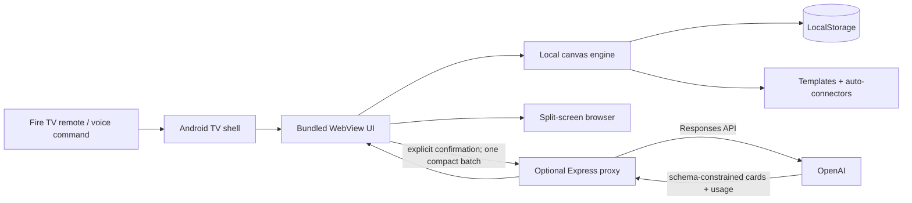

# Architecture

## Boundaries

The Android shell is deliberately thin: fullscreen lifecycle, WebView configuration, and remote key translation. All primary creation logic ships in the APK and remains usable offline. Canvas state never leaves the device during ordinary use.

The proxy exists only to prevent API-key exposure and validate/cap requests. It stores nothing. A single organization event serializes only card titles and bodies—not positions, browsing history, or unrelated local state—and sends one Responses API request. The UI makes this boundary visible before and after the call.

## Collaboration path

This MVP provides living-room collaboration through a shared screen and remote handoff. A later LAN companion client can synchronize operations through a local WebSocket/CRDT process without changing the cloud boundary: card operations remain local-network events; only explicit high-value actions reach the proxy.

## Browser constraints

Some websites block iframe embedding. A production build should replace the iframe pane with a second Android WebView and an allowlist, navigation controls, certificate handling, and parental/privacy controls.
